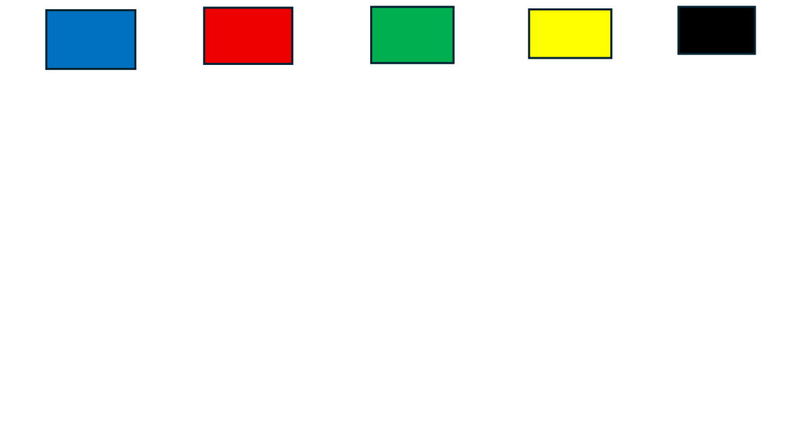
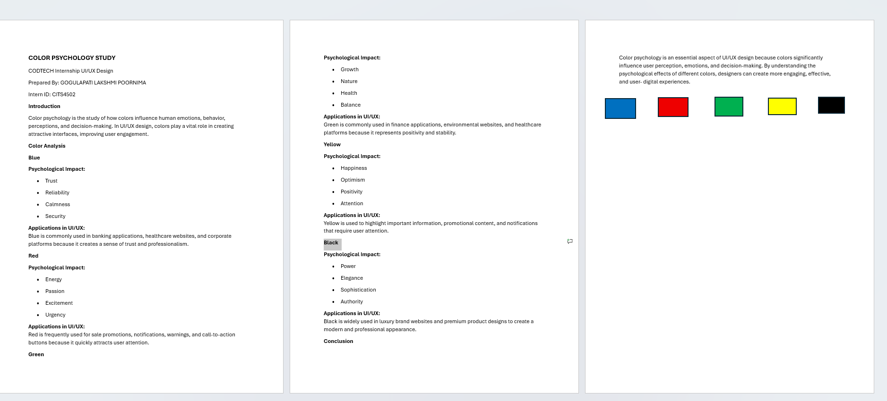
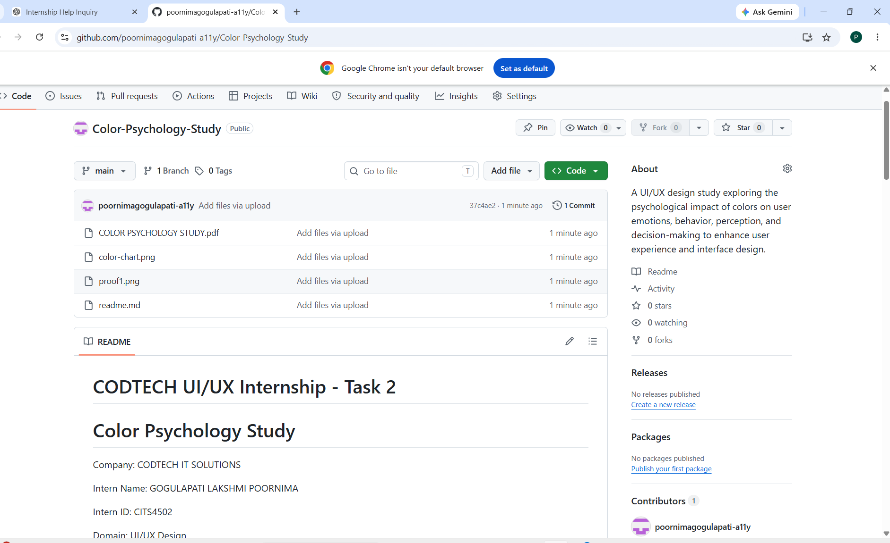

# CODTECH UI/UX Internship - Task 2

# Color Psychology Study

Company: CODTECH IT SOLUTIONS

Intern Name:  GOGULAPATI LAKSHMI POORNIMA

Intern ID: CITS4502

Domain: UI/UX Design

Duration: 8 Weeks

Mentor Name: Neela Santosh Kumar

---

## Objective

The objective of this project is to study the psychological effects of colors and understand how different colors influence user emotions, perceptions, behavior, and decision-making in UI/UX design.

---

## Description

Color psychology is an important aspect of UI/UX design. Different colors create different emotional responses and influence user behavior. This study explores the meanings, psychological impacts, and applications of commonly used colors in digital products and user interfaces.

---

## Colors and Their Meanings

### Blue

* Trust
* Reliability
* Security
* Calmness

### Red

* Energy
* Passion
* Urgency
* Excitement

### Green

* Growth
* Nature
* Health
* Balance

### Yellow

* Happiness
* Positivity
* Optimism
* Attention

### Black

* Power
* Elegance
* Sophistication
* Authority

---

## Tools Used

* Microsoft Word
* Canva
* GitHub

---

## Files Included

* Color_Psychology_Study.pdf
* color-chart.png
* proof1.png
* proof2.png
* README.md

---

## Proof of Execution

## Color Chart

### Proof 1

### Proof 2

---

## Conclusion

Color psychology plays a significant role in UI/UX design by influencing how users perceive and interact with digital products. Understanding the impact of colors helps designers create engaging, user-friendly, and effective interfaces that enhance the overall user experience.

---
